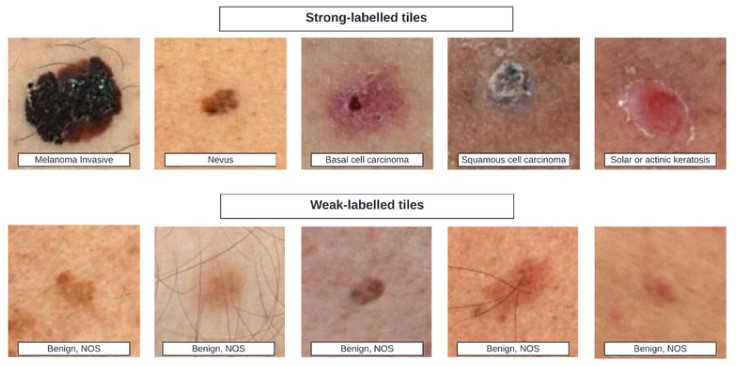

# Skin Cancer Detection Project

## Overview

Skin cancer, specifically basal cell carcinoma (BCC), squamous cell carcinoma (SCC), and melanoma, affects millions of people each year.
- ***Melanoma:*** Over 200,000 cases projected and around 9,000 deaths in 2024 in the U.S. alone.
- ***Early detection:*** Early detection is crucial, as treatment in its initial stages, such as minor surgery, has a high success rate.
- ***Lack of access:*** In the first three months of 2022, 24.6% of Mexicans reported having a health need, and only 44% of them received care.
- ***Trend:*** Less than 50 percent of the population chooses to use public services when facing a health need.
- ***Pharmacy clinics:*** Clinics adjacent to pharmacies have become a popular option for a considerable segment of the population.
- ***Mexican healthcare system:*** There are deep-rooted issues within the public healthcare system that require comprehensive and complex solutions.

 

## Objective

The objective of this project is to develop a technological solution that enables individuals to assess their own skin lesions through automated image analysis, facilitating early detection and improving patient outcomes. The system will be designed to ensure high accuracy in identifying malignant lesions, with a focus on maximizing the partial area under the ROC curve (pAUC) while achieving a true positive rate (TPR) above 80%. This will guarantee high sensitivity, particularly in detecting malignancies, which is critical for timely intervention and effective treatment.

 

## Scope and limitations

| **Scope**                                                                                | **Limitations**                                                                       |
|------------------------------------------------------------------------------------------|---------------------------------------------------------------------------------------|
| Binary image classification model for early detection of BCC, SCC, and melanoma.         | No other types of skin lesions will be considered.                                    |
| Designed for use in environments with limited access to specialized care.                | The images used will not be of high quality.                                          |
| Aim to achieve over 80% accuracy in true positives without compromising false negatives. | The model is not intended to replace specialists.                                     |

 

## Data

- **Origin:** ISIC (International Skin Imaging Collaboration).
- **Locations:** Hospital Clínic de Barcelona, Memorial Sloan Kettering Cancer Center, Melanoma Institute Australia, etc.
- **Format:** Labeled images.
- **Database size:** approx. 1 million records, with 53 variables.
- **Main variables:** mel_thick_mm, sex, body_part, size, color.
- **Time context:** The dataset contains each lesion from a subset of thousands of patients treated between 2015 and 2024 across nine institutions and three continents.
- **Image quality:** The quality of the images is similar to photos taken with a smartphone (with skin lesions in the foreground), which are regularly sent for telemedicine purposes.

 

    

## References

- Workshops and Conferences | ISIC. (s. f.). ISIC. https://www.isic-archive.com/workshops-and-conferences
- International Skin Imaging Collaboration. SLICE-3D 2024 Challenge Dataset. International Skin Imaging Collaboration https://doi.org/10.34970/2024-slice-3d (2024).
- Utilización de servicios públicos de salud en México: Uno de los retos críticos del sistema de salud. (s. f.). https://www.insp.mx/informacion-relevante/utilizacion-de-servicios-publicos-de-salud-en-mexico-uno-de-los-retos-criticos-del-sistema-de-salud
- Nicholas Kurtansky, Veronica Rotemberg, Maura Gillis, Kivanc Kose, Walter Reade, Ashley Chow. (2024). ISIC 2024 - Skin Cancer Detection with 3D-TBP. Kaggle. https://kaggle.com/competitions/isic-2024-challenge